# ExecOS 要件定義・詳細設計書 (v1.0)
<!-- Generated 2025-06-06 -->

---

## 要件定義の作成

### [C1] 作りたいアプリ
**ExecOS** — “やるべきこと”実行支援オールインワン Web/PWA。  
目標設定・タスク細分化・カレンダー連携・習慣化・セルフリフレクション・環境制御（Opal/Freedom API）を 1 画面から操作できる。

---

# ExecOS の要件定義

## 1. 概要
忙しい個人が「やるべきことを確実に実行」できるよう、目標・タスク・習慣の管理、実行支援、セルフコーチングを 1 つの PWA で提供する。

## 2. 目的
* タスク完了率を 1 か月で **+15 %**、習慣継続率を 3 か月で **+25 %** 向上させる  
* 意志力ではなく **環境と仕組み**により実行を自動化  
* 月額コスト 30 USD 以内で維持できる SaaS を構築

## 3. スコープ
* **含む** : 個人向け Web/PWA、Google/Outlook カレンダー統合、Opal/Freedom・IFTTT 連携
* **除外** : 企業 SSO、ネイティブ専用アプリ、LangGraph 等のランタイム・オーケストレーター

## 4. 機能要件
* 目標・OKR 登録と LLM リライト  
* タスク登録 → 自動チャンク化 + カレンダー登録  
* 習慣トラッカー (Streak)  
* If–Then トリガープランナー (Shortcuts/IFTTT Export)  
* 環境制御 API 呼び出し (Opal/Freedom)  
* ジャーナル記録 → LLM 要約 & コンパッション  
* Gamification (EXP, レベル, バッジ)

## 5. 非機能要件
* p95 レスポンス ← 500 ms  
* 可用性 99.5 % / 月  
* UI 日英切替、WCAG 2.1 AA 相当  
* コスト上限 30 USD / 月  
* データ暗号化 (AES‑256)、OAuth2 / OIDC

## 6. 技術要件
* Front : Next.js (React 18, TypeScript)  
* Backend : Cloudflare Workers (tRPC), D1 (SQLite), Supabase (Postgres) へ移行可  
* LLM : OpenAI GPT‑4o, Llama 3 (Ollama)  
* Auth : Google / Microsoft OAuth2  
* Infra : Cloudflare Pages + R2, GitHub Actions CI/CD

## 7. UI/UX要件
* モバイルファースト PWA、オフラインキャッシュ  
* ダッシュボード 1 画面で「今日やること」「習慣」「進捗」を俯瞰  
* ダークモード標準  
* 操作 3 タップ以内でタスク登録完了

## 8. コンテンツ要件
* ガイド付きオンボーディング (5 ステップ)  
* 週報メール (進捗サマリ + 提案)  
* FAQ / ヘルプセンター

## 9. テストと品質保証
* Jest + Playwright による E2E  
* Cloudflare Pages Preview に自動デプロイ  
* Lighthouse スコア 90 点以上  
* βユーザ 50 名による UAT

## 10. 展開と保守
* GitHub Flow + PR Review  
* 自動リリースノート生成  
* Sentry でエラー監視、Grafana Cloud でメトリクス  
* 毎月 1 回のセキュリティパッチデイ

---

# ExecOS の詳細設計

## 目次
1. [システムアーキテクチャ](#システムアーキテクチャ)
2. [データベース設計](#データベース設計)
3. [UI/UX設計](#uiux設計)
4. [機能詳細設計](#機能詳細設計)
5. [技術詳細](#技術詳細)
6. [セキュリティ設計](#セキュリティ設計)
7. [テスト計画](#テスト計画)
8. [デプロイと運用](#デプロイと運用)

---

## システムアーキテクチャ
```mermaid
graph TD
    subgraph Client
        A[PWA<br>(Next.js)]
        EXT[Browser Ext]
    end
    subgraph Cloudflare
        B[Workers API]
        C[D1 SQLite]
        R2[R2 Object Storage]
    end
    A -- tRPC --> B
    EXT -- WS --> B
    B -- HTTP --> Opal[Opal API]
    B -- HTTP --> Cal[Google Calendar]
    B -- KV --> C
    B -- Stores --> R2
```
* **フロント** : PWA + オプションでブラウザ拡張  
* **バックエンド** : Cloudflare Workers (Edge Runtime)  
* **マイクロサービス** : なし（単一サービスだが `/jobs/*` namespace でロジック分離）

---

## データベース設計
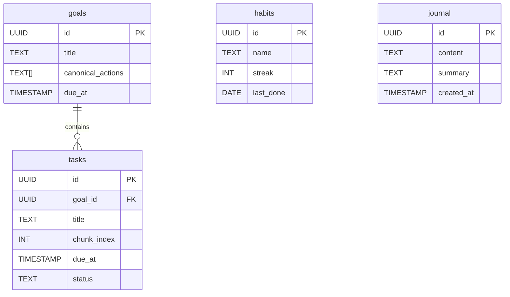
* **ER図** 上記  
* 主要エンティティ : goals, tasks, habits, journal  
* D1 (SQLite) で実装、pgvector が要る場合は Supabase へ移行

---

## UI/UX設計
* 主要画面  
  1. Dashboard  
  2. Goal & Task Editor  
  3. Habit Tracker  
  4. Journal  
  5. Settings  
* 画面遷移図 — Dashboard をハブにモーダル遷移
* カラー : Tailwind `slate` ベース + アクセント `indigo`  
* アクセシビリティ : focus ring, 色コントラスト比 >= 4.5:1

---

## 機能詳細設計
### ユーザー管理
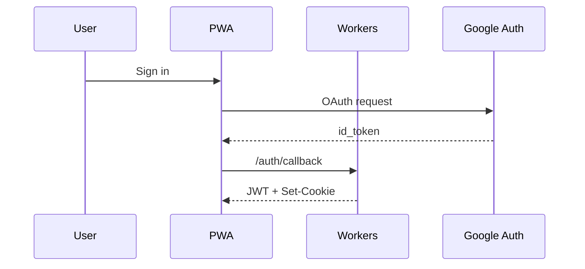
* JWT 有効期限 24 h、Refresh Token 30 d

### タスクチャンク化フロー
1. PWA → `POST /tasks`  
2. Worker → OpenAI (system prompt + user task)  
3. 取得したチャンクを Insert → `tasks` テーブル  
4. Google Calendar API Insert events


### 1. Habit Tracker フロー

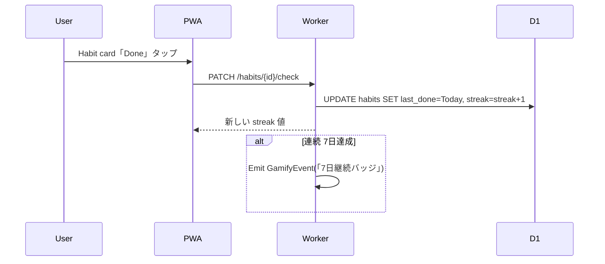

* ビジネスルール  
  * 連続日数は `last_done = yesterday+1` なら +1、途切れたらリセット  
  * 連続 7/30/100 日でバッジを発行  
  * streak は `habits.streak` に保存、月毎集計はビューで算出  

---

### 2. Trigger Planner フロー

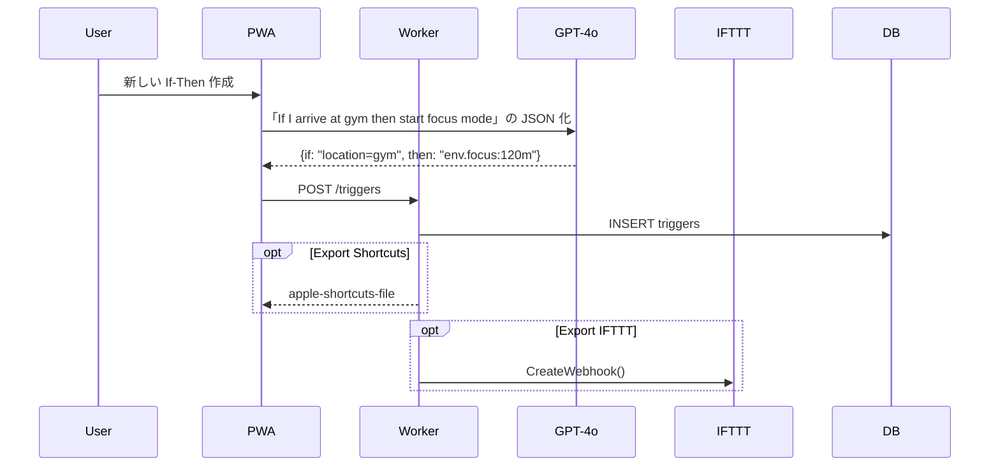

* トリガーモデル  
```json
{
  "id": "uuid",
  "if": {"type":"location","value":"gym"},
  "then": {"action":"start_focus","duration":7200},
  "export": ["ios_shortcuts","ifttt"]
}
```

---

### 3. Env Controller フロー

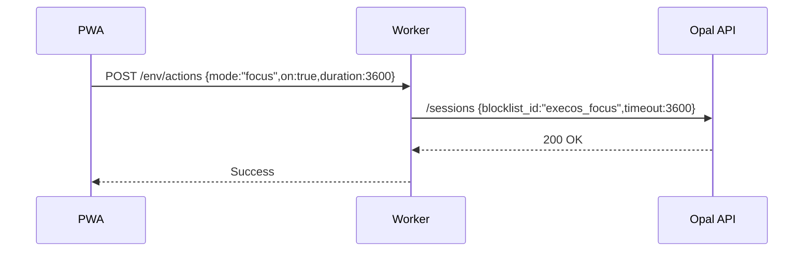

* API Key・Blocklist ID はユーザー毎に保存 (`env_credentials` テーブル)  
* 自動終了は Cloudflare Cron Trigger が残り 5 分でチェックし `PATCH /env/actions`(on:false)

---

### 4. Journal & Reframe ワークフロー

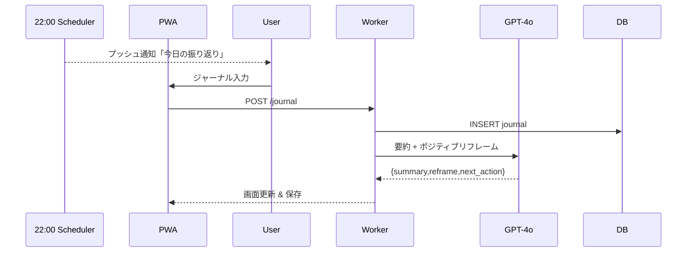

* LLM プロンプト例  
  * System: “You are a compassionate coach…”  
  * User: 日記本文  
  * Response: JSON with keys *summary*, *reframe*, *tomorrow_tip*

---

### 5. Gamify Engine

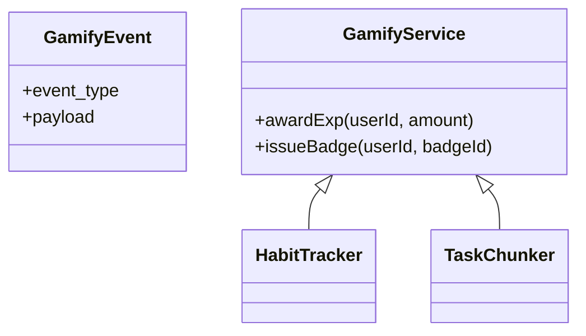

* EXP 付与ルール  
  * タスク完了: 5 EXP × chunk_size(5min)  
  * 習慣チェック: 3 EXP  
  * 連続 streak ボーナス: 10 EXP per 7 days  
* レベル計算 `level = floor(sqrt(exp_total)/5)`  
* バッジは `badges` テーブル（id, name, icon, criteria_json）で管理

---


---

## 技術詳細
* **状態管理** : TanStack Query + Zustand  
* **API** : tRPC over HTTP/2  
* **バックエンドランタイム** : Cloudflare Workers (V8 isolates)  
* **パフォーマンス** : Edge caching、LLM 呼び出しは Streaming

---

## セキュリティ設計
* OAuth2 / OIDC (Google, Microsoft)  
* HTTPS / HSTS / TLS 1.3  
* Content Security Policy strict-dynamic  
* CSRF : SameSite=Lax & Double Submit  
* XSS : React 自動エスケープ + DOMPurify for rich‑text  
* SQLi : tRPC + Prisma パラメータ化  
* セッション固定攻撃 : Regenerate JWT on auth upgrade  
* WAF : Cloudflare WAF Free Tier

---

## テスト計画
| レイヤ | ツール | 目標カバレッジ |
|--------|-------|---------------|
| 単体   | Vitest | 80 % Branch |
| 結合   | Supertest | 70 % |
| E2E    | Playwright | 主要フロー全通 |
| 性能   | k6 | p95 < 500 ms |
| セキュリティ | OWASP ZAP | 重大脆弱性 0 |

---

## デプロイと運用
* GitHub Actions → Cloudflare Pages → Workers  
* IaC : Terraform Cloud  
* ロギング : Workers Trace + Grafana Cloud  
* アラート : PagerDuty (p1) / Slack (p2)  
* バックアップ : D1 → R2 Nightly; R2 → object versioning  
* Blue‑Green deploy で無停止リリース

---

## 図式の作成

### [C4] シーケンス図（タスク登録〜チャンク化）
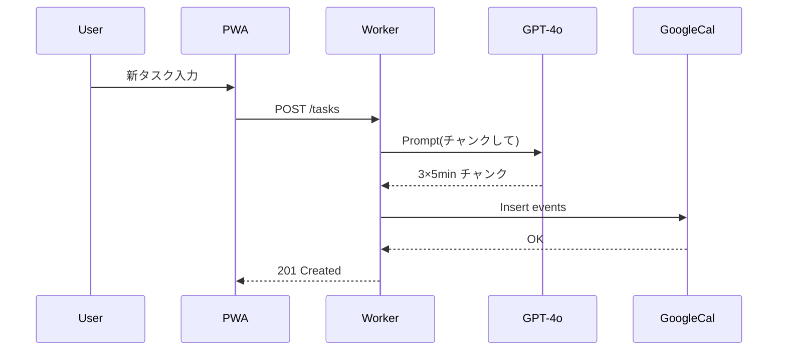

### [C5] ユースケース図
```mermaid
usecaseDiagram
    actor User
    rectangle ExecOS {
      User -- (目標登録)
      User -- (タスク登録)
      User -- (習慣チェック)
      User -- (集中モード開始)
      User -- (夜間ジャーナル)
    }
```

### [C6] クラス図（Domain Model 抜粋）
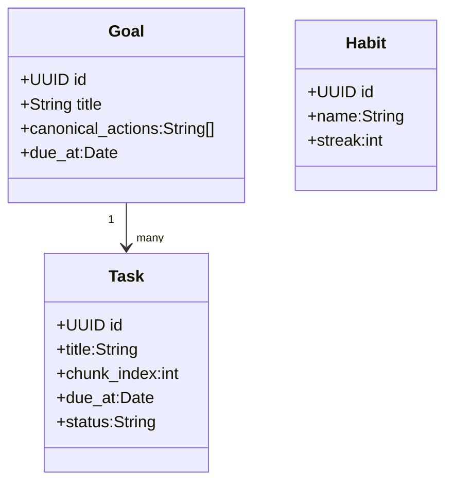

### [C7] アクティビティ図（集中モード）
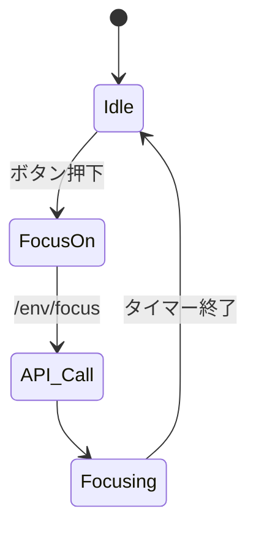

### [C8] 状態遷移図（タスク）
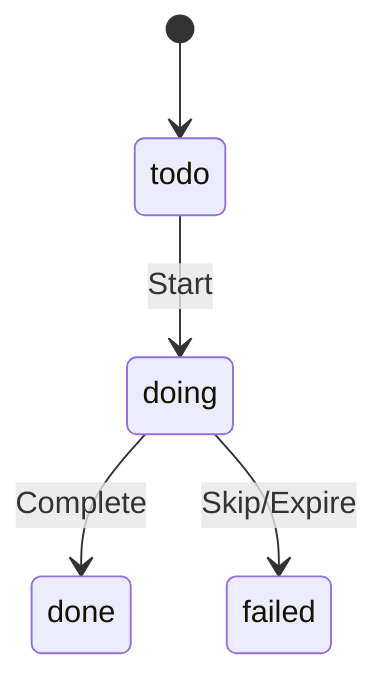

### [C9] ER図 — 上記「データベース設計」参照

### [C10] データフロー図 (DFD Level 0)
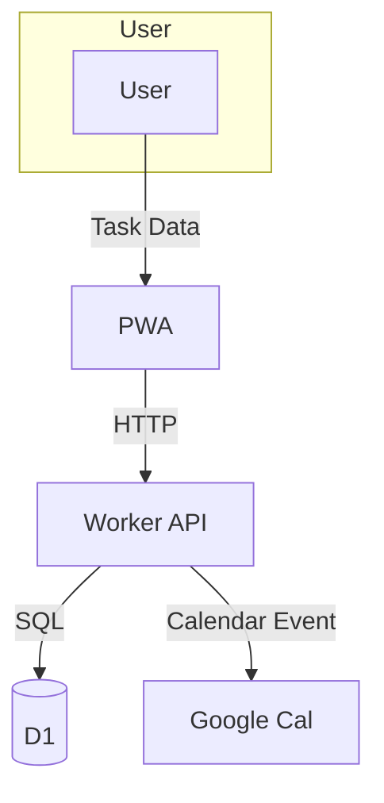

### [C11] コンポーネント図
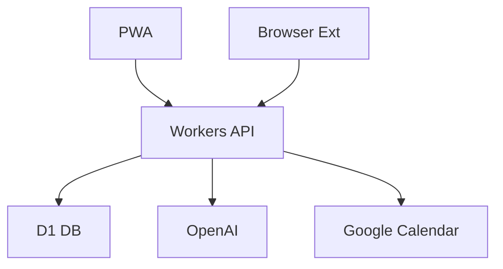

### [C12] デプロイメント図
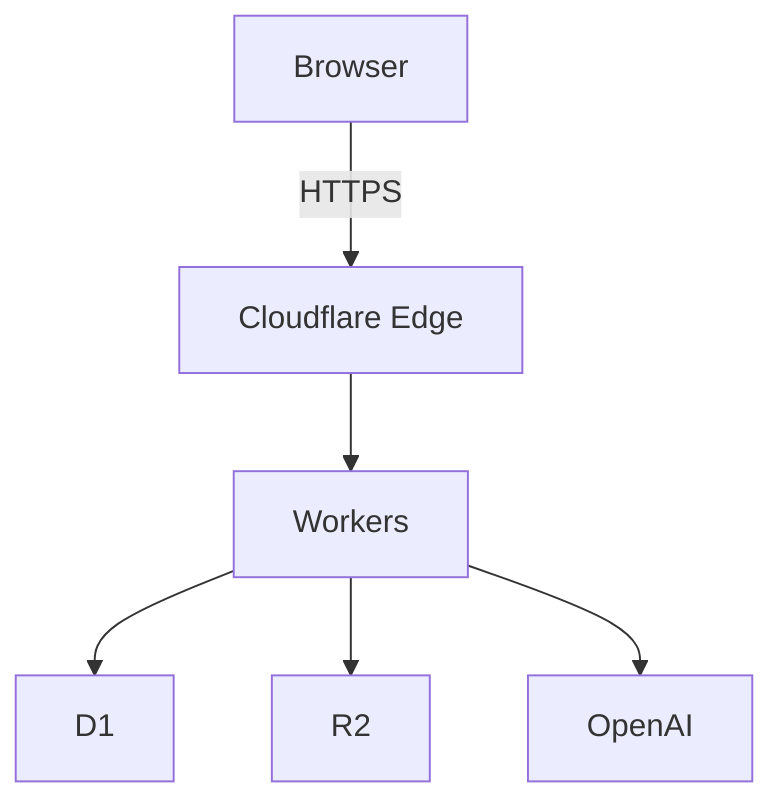

### [C13] パッケージ図
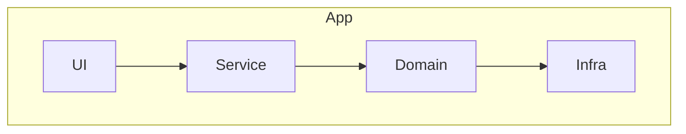

### [C14] タイミング図（習慣チェック・Streak 更新）
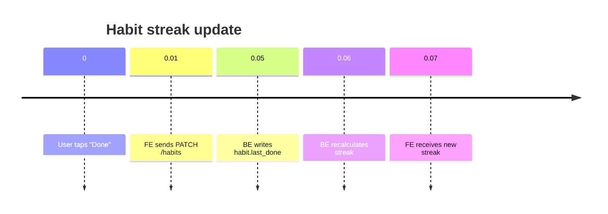

## 追加設計 — LLMコスト/安定性・機能優先度・ビジネスロジック (v1.2)

### 1. LLMコスト & 安定性ポリシー
| レイヤ | モデル | 用途 | 無料(PU)上限 | Pro(PU)上限 |
|--------|--------|------|-------------|-------------|
| High   | **GPT‑4o** | ジャーナル要約・リフレーム<br>チャンク化リトライ | 20k tok/月 | 200k tok/月 |
| Mid    | **GPT‑3.5‑Turbo** | Gamifyコメント、短文要約 | 50k tok/月 | 300k tok/月 |
| Local  | **Llama 3 8B (Ollama)** | 既定チャンク化、canonical_actions生成 | 無制限 | 無制限 |

* **rate_limit** : `30 req/min/PU` ハード制限  
* **kv_cache** : 同一入力は 24h Edge KV にキャッシュ  
* **JSON Validation** : ajv で `taskChunks.schema.json` 検証、失敗時 `max_retry=2 → fallback=llama3`.

### 2. 機能優先度 (MoSCoW)
| Priority            | 機能                                                |
| ------------------- | ------------------------------------------------- |
| **Must (v1.0)**     | 目標/タスク/習慣/ジャーナル/Gamify、Googleカレンダー                |
| **Should (v1.1)**   | Outlookカレンダー、環境制御Webhook、If‑Thenプランナー(Exportなし)   |
| **Could (Phase‑2)** | Browser Extension、Shortcuts/IFTTT Export、ネイティブVPN |
| **Won’t (当面)**      | SSO/Enterprise、多言語(>2)、AI音声入力                     |

### 3. canonical_actions フィールド
> ゴール達成に必要な典型タスク(最大10)。タスク作成モーダルで「候補」として提示し、ワンクリック追加を可能にする。

### 4. Habit Streak タイムゾーン
* すべて **UTC** 秒単位で永続化  
* ユーザ設定 `tz_offset` を用いて UI 変換  
* streak +1 判定: `datediff_utc(last_done, now_utc) == 1`

### 5. Env Controller 自動終了
* Phase‑1: Cloudflare Cron 15minポーリング  
* Phase‑2: Opal/Freedom の `session-ended` WebHook が GA された時点でイベント駆動へ移行 (Backlog #ENV‑23)
---

_End of Document_
